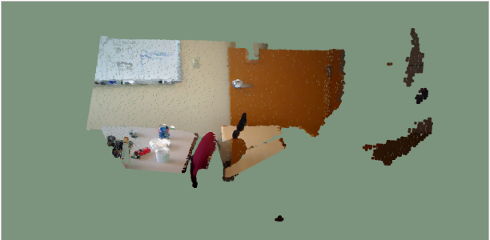
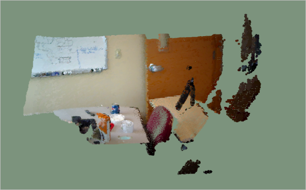

# 3D reconstruction from RGB-D images

## Intro

This repository contains an assignment in the Computational Geometry course that took place during my master's degree. More specifically, given RGB-D images, our first goal was to reconstruct the 3D surface and generate a 3D mesh object. That was performed using the ICP algorithm while achieving faster convergence using filtering techniques. Later, a segmentation technique was implemented to distinguish between the different 3D mesh objects applying the SVD technique, using normal vectors and 3D planes.

## How do I set up?

The project runs in linux distribution using the CLion IDE, so the next steps are referred to any linux system.

1. Build DJI [PCL](https://pointclouds.org/)
2. Build DJI [OpenCV](https://docs.opencv.org/4.5.2/d7/d9f/tutorial_linux_install.html)
3. For the C++ implementation:

```
mkdir build && cd build
cmake ..
make <-j # of cores>
```

## Results

<h3> 3D reconstruction for a single frame </h3>

<p align="center">

</p>

<h3> 3D reconstruction using ICP for 20 frames </h3>

<p align="center">

</p>

<h3> Segment 3D mesh object </h3>

<p align="center">

</p>


