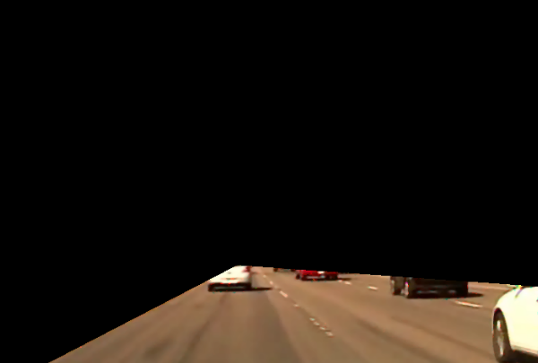
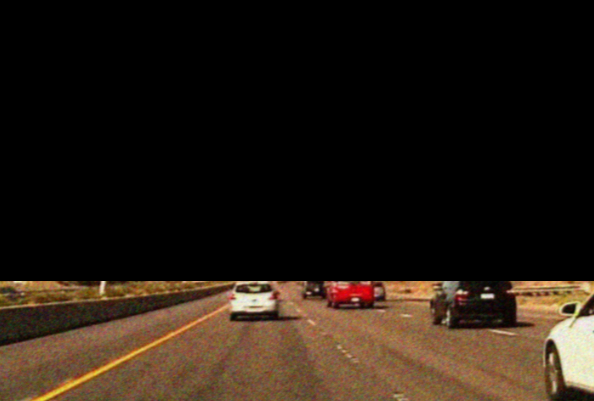
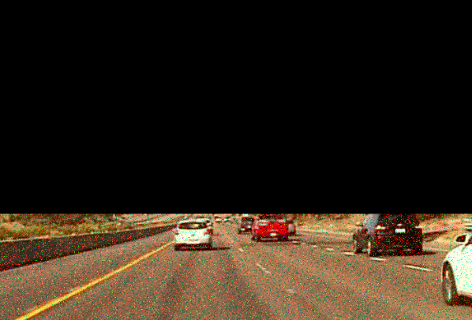
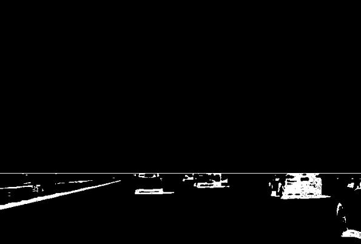
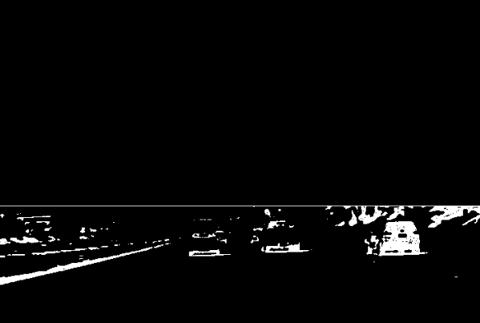
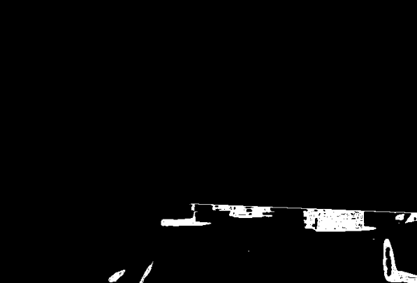

# Road segmentation and Vehicles detection in Video

## Intro

This repository contains a detection of a region of interest (ROI) algorithm and application of appropriate mask in the image sequence, to detect vehicles moving on the highway.
Adjusted techniques are applied in cases where the video frames are attacked with noise such as weight Gaussian and salt and pepper noise.

## Results

<h3 align="center"> A single frame from the input video </h3>

<h3 align="center"> ROI segmentation (1). Horizon detection and extrection </h3>

<h3 align="center"> ROI segmentation (2). Road side lines detection and extrection </h3>

<h3 align="center"> ROI segmentation. WGN/salt and pepper attacked frames  </h3>

<h3 align="center"> Vehicles detection.  </h3>

